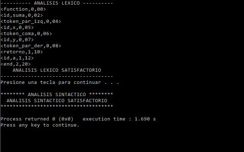

# Lexicon and Syntactic Analyzer

This is a project made in C ++, which is a Lexicon and Syntactic Analyzer of [T language](https://sites.google.com/unal.edu.co/lenguaje-t) made in 2016. It does not have a graphical interface, executed in a console.

The Lexicon and Syntactic Analyzer read the file evaluate.txt and analyze lexically and syntactically the elements that are in the file, taking into account the rules established by the language. To make these analyzes use Automatas (Lexico Analysis) and Grammatics (Syntactic Analysis)

You can see captured images of the program
# View

